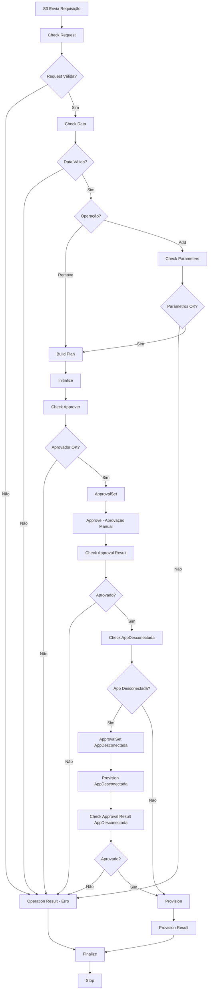

# DOCUMENTAÇÃO TÉCNICA - INTEGRAÇÃO S3 E SMARTID (IDENTITYIQ)

## 1. INTRODUÇÃO

### 1.1. Objetivo  
O presente documento tem como objetivo descrever o escopo técnico da integração entre a solução S3 e a plataforma SmartID, contemplando os processos de criação e remoção de usuários. A integração será realizada por meio de uma API disponibilizada pela SailPoint, em conjunto com a implementação de um workflow no SmartID, de forma a atender aos requisitos funcionais e operacionais desta demanda.

### 1.2. PREMISSAS
A premissa definida pela área de Cybersecurity estabelece que os fluxos de aprovação devem residir exclusivamente na camada do SmartID, e não na aplicação S3. Essa diretriz está alinhada ao papel do SmartID como solução centralizadora de identidades da companhia, garantindo governança, conformidade e padronização dos processos de gestão de acesso.

## 2. ESCOPO TÉCNICO E FUNCIONAL PARA SOLUÇÃO DE AUTENTICAÇÃO

Esta etapa descreve o escopo técnico da integração, incluindo o endpoint a ser utilizado, o método HTTP e o formato do payload esperado para concessão ou remoção de acessos.

### 2.1 Autenticação
• O mecanismo de autenticação definitivo ainda está em análise e poderá ser atualizado em versões futuras do documento.
• Provisoriamente, o consumo do endpoint será realizado utilizando Basic Authentication (usuário/senha).

### 2.2 Método POST
O recurso exposto será consumido pelo S3 por meio do endpoint:
```
http://smartid.internal.timbrasil.com.br/identityiq/rest/workflows/TIM-S3/launch
```

Esse serviço permite realizar operações de concessão ou remoção de acessos em sistemas-alvo.
• A operação é determinada pelo campo operation (add ou remove).
• O processamento é realizado a partir dos parâmetros enviados no corpo da requisição.

### 2.3 Estrutura do Payload

```json
{
  "workflowArgs": {
    "requestId": "00000000-0000-0000-0000-000000000000",
    "user": "F8015590",
    "operation": "add",
    "system": "BDOH",
    "profile": "AFBANCR1",
    "approver": "F8000036",
    "args": {
      "area": "ADMINISTRADOR"
    }
  }
}
```

### 2.4 Descrição dos Campos
• **requestId**: identificador único da requisição criada no S3.
• **user**: matrícula da identidade que receberá a ação.
• **operation**: operação a ser executada (add para concessão, remove para retirada).
• **system**: sistema-alvo onde a ação será aplicada.
• **profile**: perfil de acesso que será concedido ou removido.
• **approver**: matricula da identidade responsável pela aprovação da requisição em caso de concessão.
• **args**: parâmetros adicionais específicos da aplicação.
  - Esse objeto é flexível e pode variar de acordo com a necessidade de cada integração (ex.: área, filial, centro de custo, etc.).
  - Pode conter valores únicos (strings simples).
  - Pode conter listas de valores (arrays de strings), quando for necessário enviar múltiplos parâmetros.

## 3. WORKFLOW TIM-S3

### 3.1. Visão Geral do Processo

O workflow TIM-S3 é executado no SmartID (IdentityIQ) e processa requisições de concessão e remoção de acessos enviadas pela aplicação S3. O processo é composto por várias etapas de validação, aprovação e provisionamento.

### 3.2. Fluxo End-to-End



### 3.3. Detalhamento das Etapas

#### 3.3.1. Check Request
- **Rule**: `TIM-Rule-Workflow-S3-CheckRequest`
- **Propósito**: Validação da requisição via API S3
- **Processo**:
  1. Obtém token de autenticação da API S3
  2. Valida se a requisição existe no S3
  3. Retorna status de validação

#### 3.3.2. Check Data
- **Rule**: `TIM-Rule-Workflow-S3-CheckData`
- **Propósito**: Validação completa dos dados da requisição
- **Validações**:
  - Identidade existe e está ativa
  - Role/Perfil existe e está ativo
  - Operação é válida (add/remove)
  - Sistema está cadastrado na custom de controle
  - Argumentos são válidos conforme mapeamento da custom

#### 3.3.3. Check Parameters (Apenas para operação ADD)
- **Rule**: `TIM-Rule-Workflow-S3-CheckParameters`
- **Propósito**: Validação de parâmetros obrigatórios do formulário
- **Processo**:
  1. Busca formulários de provisionamento da role
  2. Valida campos obrigatórios
  3. Verifica se todos os parâmetros necessários foram fornecidos

#### 3.3.4. Build Plan
- **Rule**: `TIM-Rule-Workflow-S3-BuildPlan`
- **Propósito**: Construção do plano de provisionamento
- **Processo**:
  1. Cria ProvisioningPlan
  2. Configura RoleAssignment
  3. Adiciona operação (Add/Remove) ao plano

#### 3.3.5. Initialize
- **Workflow**: `TIM-S3-Identity Request Initialize`
- **Propósito**: Inicialização do processo de provisionamento
- **Processo**:
  1. Compila projeto de provisionamento
  2. Constrói conjunto de aprovações
  3. Verifica políticas
  4. Cria IdentityRequest

#### 3.3.6. Check Approver
- **Rule**: `TIM-Rule-Workflow-S3-CheckApprover`
- **Propósito**: Validação do aprovador
- **Processo**:
  1. Formata matrícula do aprovador (remove F/T, adiciona 0)
  2. Busca identidade do aprovador
  3. Valida se aprovador existe e está ativo

#### 3.3.7. ApprovalSet
- **Rule**: `TIM-Rule-Workflow-S3-ApprovalSet`
- **Propósito**: Criação do conjunto de aprovações
- **Processo**:
  1. Cria ApprovalSet
  2. Configura ApprovalItem
  3. Define aprovador e comentários
  4. Adiciona argumentos extras ao comentário

#### 3.3.8. Approve (Aprovação Manual)
- **Tipo**: Step de Aprovação
- **Propósito**: Processo de aprovação manual
- **Características**:
  - WorkItem enviado para o aprovador
  - Email de notificação automático
  - Template: `TIM-EmailTemplate-S3-Approval`

#### 3.3.9. Check AppDesconectada
- **Rule**: `TIM-Rule-Workflow-S3-CheckAppDesconectada`
- **Propósito**: Verificação se aplicação está desconectada
- **Processo**:
  1. Verifica se aplicação requer aprovação especial
  2. Define aprovador para app desconectada se necessário

#### 3.3.10. Provision
- **Workflow**: `TIM-S3-Identity Request Provision`
- **Propósito**: Execução do provisionamento
- **Processo**:
  1. Processa decisões de aprovação
  2. Executa provisionamento com retry
  3. Aguarda conclusão de itens em fila
  4. Finaliza processo

### 3.4. Subworkflows

#### 3.4.1. TIM-S3-Identity Request Initialize
- Compila projeto de provisionamento
- Constrói conjunto de aprovações
- Verifica políticas de violação
- Cria IdentityRequest

#### 3.4.2. TIM-S3-Identity Request Provision
- Processa decisões de aprovação
- Executa provisionamento
- Aguarda conclusão de itens em fila
- Finaliza processo

#### 3.4.3. TIM-S3-Provision with retries
- Executa provisionamento com sistema de retry
- Injeta parâmetros do projeto
- Gerencia tentativas de reprovisionamento

### 3.5. Rules Utilizadas

| Rule | Propósito | Status |
|------|-----------|--------|
| `TIM-Rule-Workflow-S3-GetToken` | Autenticação com API S3 | ✅ Utilizada |
| `TIM-Rule-Workflow-S3-CheckRequest` | Validação da requisição | ✅ Utilizada |
| `TIM-Rule-Workflow-S3-CheckData` | Validação de dados | ✅ Utilizada |
| `TIM-Rule-Workflow-S3-CheckParameters` | Validação de parâmetros | ✅ Utilizada |
| `TIM-Rule-Workflow-S3-BuildPlan` | Construção do plano | ✅ Utilizada |
| `TIM-Rule-Workflow-S3-CheckApprover` | Validação do aprovador | ✅ Utilizada |
| `TIM-Rule-Workflow-S3-ApprovalSet` | Criação de aprovações | ✅ Utilizada |
| `TIM-Rule-Workflow-S3-CheckApprovalResult` | Verificação de aprovação | ✅ Utilizada |
| `TIM-Rule-Workflow-S3-CheckAppDesconectada` | Verificação app desconectada | ✅ Utilizada |
| `TIM-Rule-Workflow-S3-ApprovalSet-AppDesconectada` | Aprovação app desconectada | ✅ Utilizada |
| `TIM-Rule-Workflow-S3-ModifyTask` | Modificação de tarefas | ✅ Utilizada |
| `TIM-Rule-Workflow-S3-InjectProjectArgs` | Injeção de argumentos | ✅ Utilizada |
| `TIM-Rule-Workflow-S3-ApprovalSetFinish` | Finalização de aprovações | ❌ Não utilizada |
| `TIM-Rule-Workflow-S3-RemoveDuplicateRoles` | Remoção de roles duplicadas | ❌ Não utilizada |

## 4. CONFIGURAÇÃO E PARÂMETROS

### 4.1. Variáveis do Workflow

| Variável | Tipo | Descrição | Valor Padrão |
|----------|------|-----------|--------------|
| `s3_apiKey` | String | Chave da API S3 | Configurada |
| `s3_apiSecret` | String | Secret da API S3 | Configurada |
| `s3_baseUrl` | String | URL base da API S3 | `https://azrwin0145.internal.timbrasil.com.br:8083/api/v1` |
| `customName` | String | Nome da custom de controle | `TIM-S3-Applications` |
| `fallbackApprover` | String | Aprovador padrão | `spadmin` |
| `workItemPriority` | String | Prioridade dos work items | `Normal` |

### 4.2. Templates de Email

- **Aprovação Normal**: `TIM-EmailTemplate-S3-Approval`
- **App Desconectada**: `TIM-EmailTemplate-S3-AppDesconectada`

## 5. MONITORAMENTO E LOGS

### 5.1. Logs do Workflow
O workflow gera logs detalhados em cada etapa:
- Validações de entrada
- Processamento de dados
- Criação de aprovações
- Execução de provisionamento
- Tratamento de erros

### 5.2. Monitoramento
O ambiente é monitorado através do PRTG, que acompanha em tempo real as máquinas do SMARTID. O monitoramento cobre tanto recursos de infraestrutura (CPU, memória, disco, rede) quanto a disponibilidade da aplicação.

Em caso de qualquer incidente – seja degradação de recursos ou indisponibilidade da aplicação – o PRTG gera um alerta automático. Esse alerta é encaminhado para toda a equipe responsável pelo suporte, além de também ser notificado ao cliente.

## 6. TRATAMENTO DE ERROS

### 6.1. Validações de Entrada
- Request ID inválido ou não encontrado
- Identidade não encontrada ou inativa
- Role/Perfil não encontrado ou inativo
- Aprovador não encontrado
- Parâmetros obrigatórios não fornecidos

### 6.2. Falhas de Processamento
- Erro na autenticação com API S3
- Falha na criação do plano de provisionamento
- Erro no processo de aprovação
- Falha no provisionamento

### 6.3. Ações de Recuperação
- Retry automático no provisionamento
- Fallback para aprovador padrão
- Logs detalhados para troubleshooting
- Notificações de erro via email

## 7. CONSIDERAÇÕES DE SEGURANÇA

### 7.1. Autenticação
- Uso de API Key e Secret para autenticação S3
- Validação de certificados SSL
- Timeout de conexão configurado

### 7.2. Autorização
- Validação de aprovador obrigatória
- Controle de sistemas permitidos via custom
- Validação de permissões de role

### 7.3. Auditoria
- Logs completos de todas as operações
- Rastreabilidade de aprovações
- Histórico de mudanças de acesso

## 8. EXEMPLOS DE USO

### 8.1. Exemplo de Requisição de Concessão de Acesso

```json
{
  "workflowArgs": {
    "requestId": "12345678-1234-1234-1234-123456789012",
    "user": "F8015590",
    "operation": "add",
    "system": "BDOH",
    "profile": "AFBANCR1",
    "approver": "F8000036",
    "args": {
      "area": "ADMINISTRADOR",
      "filial": "SP",
      "centro_custo": "12345"
    }
  }
}
```

### 8.2. Exemplo de Requisição de Remoção de Acesso

```json
{
  "workflowArgs": {
    "requestId": "87654321-4321-4321-4321-210987654321",
    "user": "F8015590",
    "operation": "remove",
    "system": "BDOH",
    "profile": "AFBANCR1",
    "approver": "F8000036"
  }
}
```

### 8.3. Resposta de Sucesso

```json
{
  "status": "success",
  "message": "Workflow executado com sucesso",
  "workflowId": "wf_123456789",
  "identityRequestId": "ir_987654321"
}
```

### 8.4. Resposta de Erro

```json
{
  "status": "error",
  "message": "Identidade não encontrada: F8015590",
  "errorCode": "IDENTITY_NOT_FOUND",
  "timestamp": "2024-01-15T10:30:00Z"
}
```

## 9. TROUBLESHOOTING

### 9.1. Problemas Comuns

#### 9.1.1. Erro de Autenticação
- **Sintoma**: "Falha ao obter token de autenticação"
- **Causa**: API Key ou Secret incorretos
- **Solução**: Verificar credenciais no workflow

#### 9.1.2. Identidade Não Encontrada
- **Sintoma**: "Identidade não encontrada para a matrícula F8015590"
- **Causa**: Matrícula não existe no SmartID
- **Solução**: Verificar se a identidade foi importada corretamente

#### 9.1.3. Role Não Encontrada
- **Sintoma**: "Role BDOH_AFBANCR1 não encontrada"
- **Causa**: Role não existe ou está inativa
- **Solução**: Verificar configuração da role no SmartID

#### 9.1.4. Aprovador Não Encontrado
- **Sintoma**: "Approver não encontrado após todas as tentativas"
- **Causa**: Aprovador não existe ou matrícula incorreta
- **Solução**: Verificar se aprovador existe e usar fallback

### 9.2. Logs para Análise

#### 9.2.1. Logs do Workflow
- Localização: Logs do IdentityIQ
- Filtro: "TIM-S3"
- Informações: Todas as etapas do processo

#### 9.2.2. Logs da API S3
- Localização: Logs da aplicação S3
- Filtro: "TIM-S3"
- Informações: Requisições e respostas

## 10. VERSIONAMENTO E MANUTENÇÃO

### 10.1. Histórico de Versões

| Versão | Data | Descrição | Autor |
|--------|------|-----------|-------|
| 1.0 | 2024-01-15 | Versão inicial da documentação | Equipe TIM |

### 10.2. Manutenção

#### 10.2.1. Atualizações de Rules
- Revisar rules não utilizadas periodicamente
- Implementar melhorias baseadas em feedback
- Manter compatibilidade com versões do IdentityIQ

#### 10.2.2. Monitoramento de Performance
- Acompanhar tempo de execução do workflow
- Otimizar rules com baixa performance
- Ajustar timeouts conforme necessário

## 11. CONCLUSÕES

O workflow TIM-S3 implementa um processo robusto e seguro para concessão e remoção de acessos, integrando a aplicação S3 com o SmartID. O processo garante:

- Validação completa de dados de entrada
- Controle de aprovação centralizado no SmartID
- Auditoria e rastreabilidade completas
- Tratamento de erros e recuperação automática
- Monitoramento em tempo real

A integração atende aos requisitos de governança e conformidade estabelecidos pela área de Cybersecurity, mantendo o SmartID como solução centralizadora de identidades da companhia.

---

**Documento**: DOCUMENTAÇÃO_INTEGRACAO_S3_SMARTID.md  
**Versão**: 1.0  
**Data**: 15 de Janeiro de 2024  
**Status**: Aprovado  
**Próxima Revisão**: 15 de Julho de 2024
